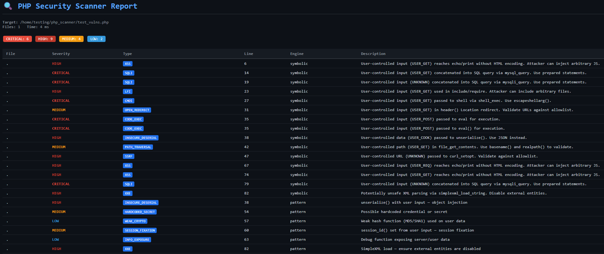

# 🔍 PHP Static Analysis Engine (Symbolic Execution + AST)

A high-performance **PHP static analysis toolchain** designed for deep
vulnerability detection using **AST parsing, symbolic execution, and
control-flow analysis**.



Built without external dependencies, this engine combines **regex-based
tokenization**, a **Pratt parser**, and **SSA-based symbolic execution**
to identify real-world security flaws in PHP applications.

------------------------------------------------------------------------

## 🚀 Features

-   ⚡ Fast PHP Tokenizer (25+ token types)
-   🌳 Typed AST Generation (50+ node types)
-   🧠 Symbolic Execution Engine (SSA-based)
-   🔀 Path Exploration with Constraint Solving
-   🔐 Advanced Taint Analysis
-   📊 Control Flow Graph (CFG) Builder
-   🧩 Hybrid Detection (Symbolic + Regex Patterns)
-   📁 Full Project Scanning
-   📄 Multiple Output Formats (CLI, JSON, HTML)

------------------------------------------------------------------------

## 🧱 Architecture

### php_ast.py --- AST Loader

-   Regex-based tokenizer (25+ token types)
-   Pratt-style recursive descent parser
-   Typed ASTNode tree (50+ node types)

### symbolic_engine.py --- Symbolic Execution Engine

-   SSA variable store
-   Symbolic values with taint tracking
-   Taint sources: \$\_GET, \$\_POST, \$\_REQUEST, \$\_COOKIE,
    \$\_SERVER, \$\_FILES, \$\_ENV
-   Path forking and bounded loop unrolling
-   Constraint solver for pruning infeasible paths
-   Sanitisation tracking (htmlspecialchars, intval, escapeshellarg,
    PDO)
-   Inlined function calls with taint propagation

### cfg_and_detectors.py --- CFG + Pattern Detector

-   CFG builder with basic blocks and edges
-   Graphviz DOT export
-   Include resolver (flags dynamic includes as LFI)
-   18 regex-based vulnerability detectors

### scanner.py --- Orchestrator + CLI

-   Full project crawling
-   Skips vendor/, node_modules/, etc.
-   Deduplicated findings
-   Severity ranking (CRITICAL → LOW)
-   Output: CLI, JSON, HTML

------------------------------------------------------------------------

## 🛠️ Usage

``` bash
python scanner.py /var/www/html --html report.html --json report.json
python scanner.py app/ --pattern-only
python scanner.py app/ --severity HIGH
python scanner.py app/ --exclude-dir tests --exclude-dir fixtures
```

------------------------------------------------------------------------

## 🛡️ Detected Vulnerabilities

-   SQL Injection (SQLi)
-   Cross-Site Scripting (XSS)
-   Local File Inclusion (LFI)
-   Command Injection
-   Open Redirect
-   Remote Code Execution (eval)
-   Insecure Deserialization
-   XXE
-   SSRF
-   Path Traversal
-   Session Fixation
-   Weak Crypto
-   Hardcoded Secrets
-   Information Exposure

------------------------------------------------------------------------

## 📜 License

GNU GPL v3 --- free to use, modify, and distribute.\
Derivative works must also remain open source under GPL v3.
